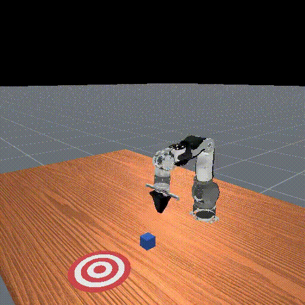
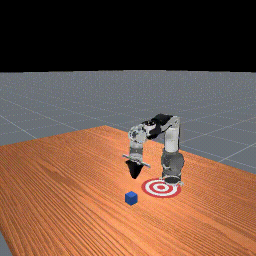
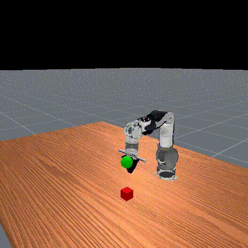

## Installation Guide

### Specification
This repository has been tested on Ubuntu 22.04.
We do not guarantee that it will work on other platforms.

### Install ManiSkill
The required versions are:

* **ManiSKill v3.0.0b21**

From this point on, it is assumed that you have created a virtual environment named `env_maniskill` using miniconda or anaconda and will be working within that environment.

Please refer to the [official](https://maniskill.readthedocs.io/en/latest/user_guide/getting_started/installation.html) page for the installation method of ManiSkill.  
Here, we provide a sample installation procedure.

1. Create virtual environment  
```bash
conda create -n env_maniskill python=3.11
```
2. Activate your virtual env
```bash
conda activate env_maniskill
```
3. Install libvulkan
```bash
sudo apt-get install libvulkan1
```
4. Clone Maniskill git at your HOME directory
```bash
cd ~
git clone https://github.com/haosulab/ManiSkill.git
```

5. Install Maniskill
```bash
cd ManiSkill && pip install -e .
pip install torch torchvision torchaudio tensorboard wandb
```

6. Install OpenArm pick up task
```bash
cd ~
git clone https://github.com/enactic/openarm_maniskill_simulation.git
# copy openarm assets
cp -r ~/openarm_maniskill_simulation/urdf ~/ManiSkill/mani_skill/assets/robots/openarm

# copy agents(robot)
cp ~/openarm_maniskill_simulation/mani_skill/agents/robots/__init__.py ~/ManiSkill/mani_skill/agents/robots
cp -r ~/openarm_maniskill_simulation/mani_skill/agents/robots/openarm ~/ManiSkill/mani_skill/agents/robots

# copy task files
cp ~/openarm_maniskill_simulation//mani_skill/envs/tasks/tabletop/pick_cube.py ~/ManiSkill/mani_skill/envs/tasks/tabletop
cp ~/openarm_maniskill_simulation//mani_skill/envs/tasks/tabletop/pick_cube_cfgs.py ~/ManiSkill/mani_skill/envs/tasks/tabletop
cp ~/openarm_maniskill_simulation//mani_skill/envs/tasks/tabletop/pull_cube.py ~/ManiSkill/mani_skill/envs/tasks/tabletop
cp ~/openarm_maniskill_simulation//mani_skill/envs/tasks/tabletop/push_cube.py ~/ManiSkill/mani_skill/envs/tasks/tabletop
``` 

### Run Training
You can run different tasks.
Replace <TASK_NAME> with one of the following available tasks:


| Task Description        | Task Name                      |  Demo                               |
| ----------------------- | ------------------------------ | ----------------------------------- | 
| Push the cube to the center of the target.　| `PushCube-v1` | |
| Pull the cube to the cente of the target. | `PullCube-v1` |   |
| Pick up the cube and move it to the target position.　| `PickCube-v1` |   |


```bash
cd ~/ManiSkill/examples/baselines/ppo/
python ppo.py \
	--env_id=<Task Name> \
	--exp-name=<Task Name> \
	--num_envs=1024 \
	--total_timesteps=12_000_000 \
	--eval_freq=10 \
	--num-steps=20 \
	--num_eval_envs 8
```
If you want to manage training logs with [Weights & Biases](https://wandb.ai/site/), please run the following.
```bash
export WANDB_API_KEY=`your wandb api key`
cd ~/ManiSkill/examples/baselines/ppo/
python ppo.py \
	--env_id=<Task Name> \
	--exp-name=<Task Name> \
	--num_envs=1024 \
	--total_timesteps=12_000_000 \
	--eval_freq=10 \
	--num-steps=20 \
    --track \
	--wandb_project_name `your wandb project name` \
	--exp-name `your wandb experiment name` \
	--num_eval_envs 8
```

### Run evaluate
How to evaluate a trained model.
```bash
cd ~/ManiSkill/examples/baselines/ppo/
python ppo.py \
       --env_id=<Task Name> \
       --evaluate \
       --checkpoint `your training model path`
       --exp-name=<Task Name> \
       --num_eval_envs=1
```
```
Running evaluation
####
args.num_iterations=390 args.num_envs=512 args.num_eval_envs=1
args.minibatch_size=800 args.batch_size=25600 args.update_epochs=4
####
Epoch: 1, global_step=0
Evaluating
Evaluated 50 steps resulting in 1 episodes
eval_success_once_mean=1.0
eval_return_mean=39.73570251464844
eval_episode_len_mean=50.0
eval_reward_mean=0.7947140336036682
eval_success_at_end_mean=1.0
```

